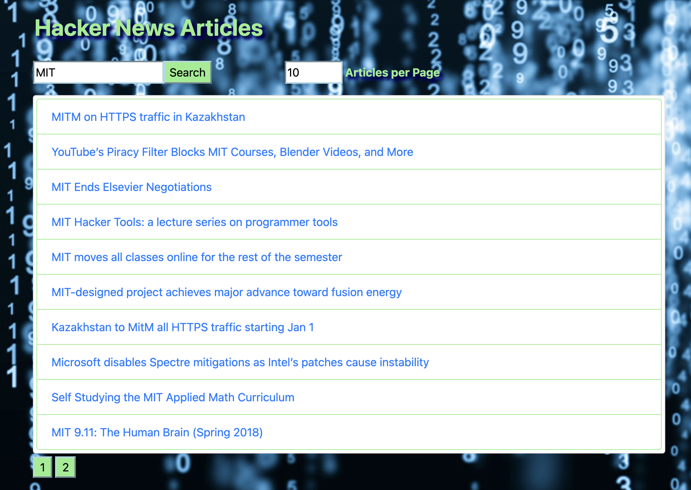

# Hacker-News-Search
A web page that allows users to perform a keyword search of Hacker News articles

This is the code for a basic Web application made with React to provides for a key word search of haacker News Articles. It originated from an assignment in Week #15 of MIT's MERN Coding Bootcamp. The challenge was to fetch data from an external source and build a site and user experience around the data organizing and displaying the fetched data in a way that is appropriate to the story being told with the data. .

<h2>Features</h2>
<ol>
<li>React useState is used to hold the URL address for the article feeds.</li>
<li>React useEffect is used to implement the fetch functions.</li>
<li>React useReducer is used to track the status of the data stream.</li>
<li>Axios is used to make the fetch request.</li>
<li>ReactBoot is used for styling components.</li>
<li>An Adobe stock photo was used for the background of the page.</li>
  <li><a src="https://github.com/HackerNews/API">The Hacker New feed public API was used as the source of article</a></li>
</ol>

<h2>To see the web page in action follow this link:</h2>
<a href="https://codesandbox.io/s/hackernewsarticles-react-ut8l5">Link to CodeSandbox</a>
<h2>To use:</h2>
<ul>
<li>Fork this repository</li>
<li>Clone copy to your desktop</li>
<li>Open a command line on your computer and run the command cd path/to/project/root. (path/to/project/root should be replaced with the actual path to the project folder)</li>
<li>Within the same command-line window, run 'npm install' to install all dependencies.</li>
<li>Within the same command-line window, run 'npm start' to start the application in your browser.</li>
  </ul>
<h2>Contributors</h2>
<ul>
  <li>Bill Conley</li>
  <li>Dr. John Williams</li>
 </ul>
<h2>License</h2>

Copyright (c) 2021 Bill Conley

Permission is hereby granted, free of charge, to any person obtaining a copy
of this software and associated documentation files (the "Software"), to deal
in the Software without restriction, including without limitation the rights
to use, copy, modify, merge, publish, distribute, sublicense, and/or sell
copies of the Software, and to permit persons to whom the Software is
furnished to do so, subject to the following conditions:

The above copyright notice and this permission notice shall be included in all
copies or substantial portions of the Software. 

THE SOFTWARE IS PROVIDED "AS IS", WITHOUT WARRANTY OF ANY KIND, EXPRESS OR
IMPLIED, INCLUDING BUT NOT LIMITED TO THE WARRANTIES OF MERCHANTABILITY,
FITNESS FOR A PARTICULAR PURPOSE AND NONINFRINGEMENT. IN NO EVENT SHALL THE
AUTHORS OR COPYRIGHT HOLDERS BE LIABLE FOR ANY CLAIM, DAMAGES OR OTHER
LIABILITY, WHETHER IN AN ACTION OF CONTRACT, TORT OR OTHERWISE, ARISING FROM,
OUT OF OR IN CONNECTION WITH THE SOFTWARE OR THE USE OR OTHER DEALINGS IN THE
SOFTWARE.

